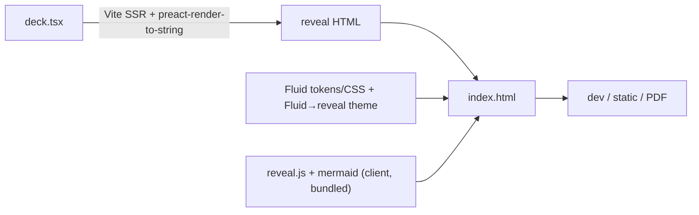

# lectern

> Author professional [reveal.js](https://revealjs.com) slide decks as typed TSX components, styled by the ENGIE [Fluid design system](https://www.engie.design/fluid-design-system/).

`lectern` separates the three concerns of a slideshow: what you show (content), how it looks (style), how it's laid out; and takes the last two off your plate. You describe a deck's _semantic content_ with components (`<Slide>`, `<Bullets>`, `<Columns>`, `<Mermaid>`, `<Metric>`…); reveal.js orchestrates the presentation and Fluid tokens supply a consistent, on-brand look. When a single slide needs manual control, every component takes a `class`/`style` escape hatch and `<Raw>` injects arbitrary HTML.

- TSX authoring, fully typed; your editor autocompletes the deck
- Fluid-themed reveal.js out of the box (ENGIE blue, Lato, spacing, elevation)
- Mermaid diagrams, syntax-highlighted code, KPI cards, timelines, speaker notes
- One command each for a live dev server, a self-contained static `index.html`, and a PDF

## Requirements

- Node ≥ 20, a package manager (pnpm recommended)
- For `lectern pdf`: Playwright's Chromium: `npx playwright install chromium` (one-time)

## Quick start

Write a deck as a `.tsx` file whose default export is a `<Deck>`:

Neutral primitives come from `lectern`; the philosophy-bearing slides and styled atoms come from a **profile** (`lectern/engie`) — see [Profiles](#profiles).

```tsx
// deck.tsx
import { Columns, Code, Mermaid, Notes } from 'lectern'
import { Deck, TitleSlide, SectionSlide, Slide, Summary, Bullets, Metric, Timeline } from 'lectern/engie'

export default (
  <Deck title="Alternance Engie — Point d'étape" author="Raphaël Bardini" date="Juin 2026" footer="Confidentiel">
    <TitleSlide
      eyebrow="ENGIE"
      title="Point d'étape"
      subtitle="Système de validation"
      author="Raphaël Bardini"
      date="Juin 2026"
    />

    <SectionSlide number="01" title="Contexte" />

    <Slide heading="Le projet" kicker="Mission">
      <Bullets items={['Automatiser la chaîne de validation', 'Sur Power Platform / Dataverse']} incremental />
      <Notes>Rappeler le périmètre métier.</Notes>
    </Slide>

    <Slide heading="Architecture cible">
      <Mermaid>{`flowchart LR
  A[Demande] --> B{Validation}
  B -->|OK| C[Terminé]
  B -->|KO| D[Rejeté]`}</Mermaid>
    </Slide>

    <Slide heading="Détail technique">
      <Columns ratio={[3, 2]}>
        <Code lang="js">{`if (equals('fr', locale)) { /* … */ }`}</Code>
        <Bullets items={["Génération d'expressions WDL", 'Macros et abstractions']} />
      </Columns>
    </Slide>

    <Slide heading="Indicateurs">
      <Columns>
        <Metric value="12" label="Flows livrés" trend="+4 ce mois" tone="positive" />
        <Metric value="3" label="Environnements" />
      </Columns>
    </Slide>
  </Deck>
)
```

Then:

```bash
lectern dev   deck.tsx            # live-reload dev server (default http://localhost:4321)
lectern build deck.tsx -o dist    # self-contained dist/index.html (open offline, host anywhere)
lectern pdf   deck.tsx -o deck.pdf # PDF export via headless Chromium
```

Running inside this repo, use `pnpm lectern <cmd>` (an alias for `node --import tsx ./src/cli/index.ts`).

## Learn by example

The fastest way to learn `lectern` is to copy a working deck:

- `examples/engie-alternance/deck.tsx`: a full ~19-slide deck: title, section dividers, columns, a Mermaid flowchart, KPI cards, a timeline, code, quotes and speaker notes. This is the canonical "what can it do" reference.
- `examples/smoke/deck.tsx`: a minimal deck touching each component type.

Try one live: `pnpm lectern dev examples/engie-alternance/deck.tsx`.

Every component carries JSDoc, so your editor shows what each one does and which props it takes as you type: that's the up-to-date reference.

## Authoring with TSX

Extend Lectern's authoring config in your project's `tsconfig.json`:

```jsonc
{
  "extends": "lectern/tsconfig.json",
  "include": ["deck.tsx"]
}
```

The exported config sets Lectern's automatic JSX runtime and Vite asset typings, so imports such as `./diagram.svg?raw` are typed as strings. Keep your project's own target, strictness, module settings, and include paths alongside the `extends` entry. If you override `compilerOptions.types`, include `lectern/vite-env` in that list. Typecheck the project configuration with `pnpm exec tsc --noEmit`; do not pass a source filename directly to `tsc`, because that bypasses `tsconfig.json`.

Components render to static HTML at build time (via `preact-render-to-string`); there is no Preact runtime in the browser. reveal.js and Mermaid run client-side on the produced HTML.

### Components

Components split by **who owns the layout decision**. Neutral, structure-only primitives live in core `lectern`; the philosophy-bearing slides and opinionated atoms live in a profile (`lectern/engie`). A profile's CSS styles everything.

**Core `lectern`** (neutral — reusable across profiles):

| Component                                                  | Purpose                                          |
| ---------------------------------------------------------- | ------------------------------------------------ |
| `<Deck>`                                                   | Root; holds metadata + slides                    |
| `<Columns ratio tracks fill>` / `<Stack fill>` / `<Grid cols>` / `<Spacer>` | Layout primitives               |
| `<Code lang lineNumbers>` / `<Mermaid>`                    | Highlighted code · Mermaid diagram               |
| `<Notes>` / `<Fragment>` / `<Raw html>`                    | Speaker notes · fragment · raw-HTML escape hatch |

**`lectern/engie`** (the ENGIE authoring surface — template-accurate):

| Component                         | Purpose                                            |
| --------------------------------- | -------------------------------------------------- |
| `<Deck>`                          | ENGIE-bound root (pins `profile="engie"`)          |
| `<TitleSlide>`                    | Navy cover, white title, logo, confidentiality tag |
| `<SectionSlide number>`           | Navy full-bleed section divider                    |
| `<Slide heading subtitle kicker>` | Content slide (navy title, ~25pt)                  |
| `<Summary items>`                 | Numbered chapters / agenda                         |
| `<Bullets>` / `<Steps>`           | Lists                                              |
| `<Metric value label trend tone>` | KPI figure                                         |
| `<Timeline items>`                | Opinionated **horizontal** timeline                |
| `<Quote cite>` / `<Lead>`         | Emphasis                                           |
| `<Star.Situation>` / `.Task` / `.Action` / `.Result` | STAR stages in normal flow, with no wrapper |
| `<Swot strengths weaknesses opportunities threats>` | Editorial SWOT matrix with a central S/W/O/T marker |

### Escape hatches

- Every layout/content component accepts `class` and `style` for a one-off tweak.
- `<Slide>` accepts `background`, `transition`, `autoAnimate`, and raw reveal attributes via `attrs={{ "data-…": … }}`.
- `<Raw html="…" />` for anything not yet covered by a component.

## CLI

```sh
lectern dev   [deck.tsx] [--port 4321]
lectern build [deck.tsx] [--out dist] [--no-single-file]
lectern pdf   [deck.tsx] [--out deck.pdf]
lectern rules [profile]              # print a profile's guidelines (default: engie)
```

- `build` inlines all JS/CSS/assets into a single `index.html` by default. Use `--no-single-file` to emit a folder of hashed assets instead.
- `pdf` reuses the build output and drives reveal's `?print-pdf` mode. It waits for reveal and every Mermaid diagram to finish before printing.
- `rules` prints the natural-language rulebook for a profile (see below).

## Profiles

A **profile** is a deck authoring _philosophy_, not just a skin. It owns:

- its **component set** — the slides/atoms whose layout embodies the house style (`lectern/engie` exports these; importing them selects the profile);
- its **look** — a `.profile-<name>`-scoped stylesheet that also styles the neutral core components;
- its **reveal config** (aspect ratio, transitions, `center`, …);
- its **rules** — a natural-language rulebook (documentation today; no linting yet).

Because a profile owns components, **switching profile is an import change**, not a one-liner — and a profile need not even have the same components (it might have no `TitleSlide`, or a different `Timeline`). The `engie` profile reproduces the official ENGIE PowerPoint template (navy `#17255F` cover, restrained navy titles, numbered Summary, horizontal Timeline, 8pt © ENGIE footer). View its rules:

```sh
lectern rules engie
```

A new profile is a folder under `src/profiles/<name>/` — a `Profile` metadata object (registered in `src/profiles/index.ts`), its components, and a scoped stylesheet — exposed as the `lectern/<name>` package subpath. Shared, genuinely-neutral atoms can be lifted into core `lectern` once a second profile shows what's actually common.

## How it works



The Fluid theme maps reveal's `--r-*` variables onto Fluid `--nj-*` design tokens (`src/render/theme.css`), so any deck is on-brand with zero per-slide styling.

## Notes

- Fonts: the Fluid token stack leads with Lato; if it isn't available it falls back to the system sans-serif. Bundle the licensed brand font in your project if you need it embedded.
- Mermaid: diagrams render client-side and are pinned to a metric-stable font so labels never clip under the Fluid cascade.
- Built with reveal.js 6, Mermaid 11, Fluid 6, Preact + Vite.

## Development

```bash
pnpm install          # (in this repo: uses --ignore-workspace)
pnpm build            # bundle lib + CLI + d.ts (tsup)
pnpm test             # vitest
pnpm typecheck        # tsc --noEmit
```
